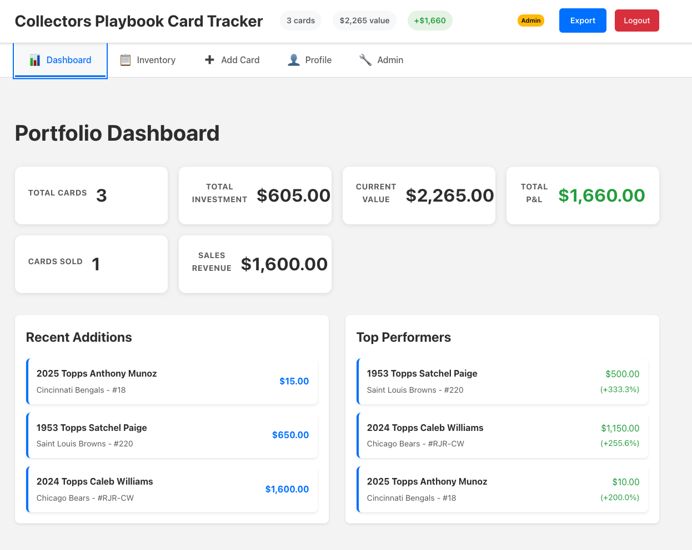
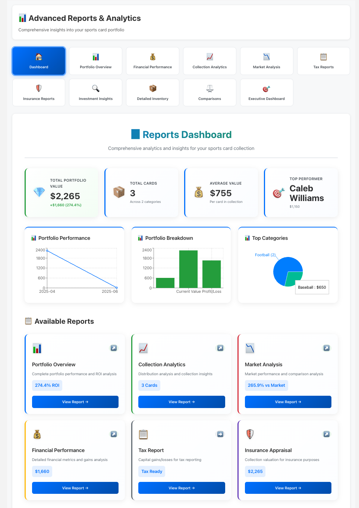
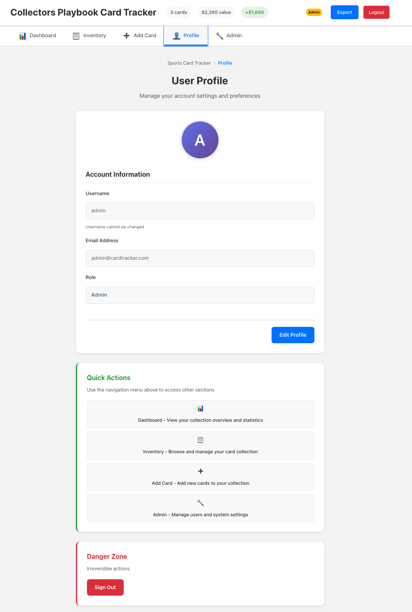

# Sports Card Tracker

A modern, full-stack web application for tracking and managing sports card collections with multi-user support, shared collections, comprehensive reporting, and professional-grade card data management.


## ✨ Features

### 🃏 **Enhanced Card Management**

- **Comprehensive Data Model**: Track 100+ data points per card including:
  - Complete identification (manufacturer, product line, print runs)
  - Player metadata (rookie status, HOF, career achievements)
  - Authentication & grading details with subgrades
  - Special features (autographs, memorabilia, patches)
  - Market data with price history and comparables
  - Physical attributes and condition notes
  - Storage location and organization
  - Insurance and transaction details
  - Personal ratings and collection metadata
- **Dual Form System**: Toggle between classic quick-entry and enhanced professional forms
- **Multiple image upload** with 100MB file size support
- **Advanced filtering** and search capabilities
- **Sold banner overlay** for cards with sale dates
- **Edit/Delete controls** positioned at bottom-right of cards

### 👥 **Multi-User System**

- User registration and authentication with JWT tokens
- Shared collections - multiple users can access the same card collection
- Role-based access control (Admin/User)
- Secure profile management with photo uploads

### 📊 **Professional Reporting Suite**

- **10+ Report Types**:
  - Portfolio Performance with ROI Analysis
  - Collection Analytics & Distribution
  - Player Performance Reports
  - Team/Set Analysis
  - Market Trends & Investment Insights
  - Tax Reports (Capital Gains/Losses)
  - Insurance Appraisal Documentation
  - Selling Opportunities
  - Custom Reports with Dynamic Filtering
- **Visual Analytics Dashboard** with charts and graphs
- **Export Options**: PDF, CSV, and Excel formats
- **Professional PDF Generation** with headers, footers, and branding

### 🔧 **Admin Dashboard**

- Global admin can view all users, collections, and cards
- System statistics and user management
- Collection membership management
- Real-time monitoring of app usage

### 🎨 **Modern UI/UX**

- Responsive design that works on all devices
- Dark/light theme support with accessibility features
- Intuitive navigation with breadcrumbs
- Real-time updates and loading states
- Tabbed interface for enhanced card forms
- Professional form styling with validation

### 📱 **User Profiles**

- Update email addresses and passwords
- Upload and manage profile photos
- Account settings and preferences
- Quick navigation to app sections

## 📸 Screenshots

### Dashboard - Portfolio Overview



> [!NOTE]
> View your complete portfolio statistics, recent additions, and top performing cards at a glance.

---

### Inventory - Card Grid View


> [!NOTE]
> Browse and manage your card collection with advanced filtering, sold banners, and repositioned controls.

---

### Enhanced Card Form - Professional Data Entry


> [!NOTE]
> Comprehensive card data entry with 10 tabbed sections covering every aspect of professional card collecting.

---

### Reports Dashboard - Analytics & Insights



> [!NOTE]
> Professional reporting suite with visual analytics, 10+ report types, and multiple export formats.

---

### User Profile Management



> [!NOTE]
> Manage your account settings, update profile information, and customize preferences.

---

### Admin Dashboard


> [!NOTE]
> System administrators can manage users, collections, and monitor platform statistics.

## 🏗️ Architecture

- **Frontend**: React 18 + TypeScript + CSS3
- **Backend**: Node.js + Express.js
- **Database**: In-memory storage (easily replaceable with persistent DB)
- **Authentication**: JWT tokens with bcrypt password hashing
- **File Handling**: Base64 image storage (100MB limit per image)
- **Reporting**: jsPDF for PDF generation, Chart.js/Recharts for visualizations

## 📋 Prerequisites

- **Node.js** >= 16.0.0
- **npm** >= 8.0.0
- **Git** (for cloning the repository)

## 🚀 Quick Start

### 1. Clone the Repository

```bash
git clone <repository-url>
cd sports-card-tracker
```

### 2. Install Dependencies

```bash
# Install frontend dependencies
npm install

# Install backend dependencies
cd server
npm install
cd ..
```

### 3. Start Development Servers

```bash
# Terminal 1: Start backend server
cd server
node memory-server.js

# Terminal 2: Start frontend development server (in new terminal)
npm start
```

### 4. Access the Application

- **Frontend**: http://localhost:3000
- **Backend API**: http://localhost:8000

## 🛠️ Development Setup

### Backend Development

```bash
cd server
node memory-server.js    # Starts server on port 8000
```

### Frontend Development

```bash
npm start      # Starts React development server with hot reload
npm test       # Run test suite
npm run build  # Build for production
```

### Environment Configuration

Create a `.env` file in the root directory:

```env
REACT_APP_API_URL=http://localhost:8000/api
```

For backend configuration, edit `server/memory-server.js`:

```javascript
const PORT = 8000;
const JWT_SECRET = "your-super-secret-jwt-key-change-in-production";
const MAX_FILE_SIZE = 100 * 1024 * 1024; // 100MB
```

## 🏭 Production Deployment

### Option 1: Manual Deployment

#### 1. Build the Application

```bash
# Build frontend
npm run build

# The build folder contains production-ready files
```

#### 2. Deploy Backend

```bash
cd server

# Install production dependencies
npm install --production

# Start production server
node memory-server.js

# Or with PM2 for process management
npm install -g pm2
pm2 start memory-server.js --name "card-tracker-api"
```

#### 3. Serve Frontend

```bash
# Option A: Use a static file server
npm install -g serve
serve -s build -l 3000

# Option B: Use nginx (recommended)
# Copy build/* to your nginx web root
# Configure nginx to proxy API calls to backend
```

### Option 2: Docker Deployment

#### Create Dockerfile for Backend

```dockerfile
# server/Dockerfile
FROM node:16-alpine
WORKDIR /app
COPY package*.json ./
RUN npm install --production
COPY . .
EXPOSE 8000
CMD ["node", "memory-server.js"]
```

#### Create Dockerfile for Frontend

```dockerfile
# Dockerfile
FROM node:16-alpine as build
WORKDIR /app
COPY package*.json ./
RUN npm install
COPY . .
RUN npm run build

FROM nginx:alpine
COPY --from=build /app/build /usr/share/nginx/html
COPY nginx.conf /etc/nginx/nginx.conf
EXPOSE 80
CMD ["nginx", "-g", "daemon off;"]
```

#### Docker Compose

```yaml
# docker-compose.yml
version: "3.8"
services:
  backend:
    build: ./server
    ports:
      - "8000:8000"
    environment:
      - NODE_ENV=production

  frontend:
    build: .
    ports:
      - "80:80"
    depends_on:
      - backend
```

Run with:

```bash
docker-compose up -d
```

### Option 3: Cloud Deployment

#### Heroku Deployment

```bash
# Install Heroku CLI
npm install -g heroku

# Login and create app
heroku login
heroku create your-app-name

# Deploy backend
cd server
git init
git add .
git commit -m "Initial commit"
heroku git:remote -a your-app-name
git push heroku main

# Deploy frontend to Netlify/Vercel
# Build and upload the build/ folder
```

## 🔐 Default Admin Account

The application creates a default admin account on first startup:

- **Email**: `admin@cardtracker.com`
- **Password**: `admin123`
- **Role**: Admin

**⚠️ Important**: Change the default admin password immediately in production!

## 📁 Project Structure

```
sports-card-tracker/
├── public/                 # Static files
│   ├── generic.png        # Default card image
│   └── favicon.ico        # App icon
├── src/                   # React frontend source
│   ├── components/        # React components
│   │   ├── Auth/         # Authentication components
│   │   ├── Dashboard/    # Dashboard components
│   │   ├── CardList/     # Card listing components
│   │   ├── CardForm/     # Classic card form
│   │   ├── EnhancedCardForm/ # Professional card form
│   │   ├── Reports/      # Reporting suite
│   │   ├── UserProfile/  # User profile management
│   │   ├── AdminDashboard/ # Admin interface
│   │   └── Layout/       # App layout and navigation
│   ├── context/          # React context providers
│   ├── hooks/            # Custom React hooks
│   ├── services/         # API and reporting services
│   ├── types/            # TypeScript type definitions
│   │   ├── index.ts      # Core types
│   │   ├── card-enhanced.ts # Enhanced card model
│   │   └── reports.ts    # Report types
│   └── utils/            # Utility functions
│       ├── pdfExport.ts  # PDF generation
│       ├── cardMigration.ts # Data migration
│       └── validation.ts # Form validation
├── server/               # Backend source
│   ├── memory-server.js  # Main server file
│   └── package.json      # Backend dependencies
├── build/                # Production build (generated)
└── README.md            # This file
```

## 🔌 API Endpoints

### Authentication

- `POST /api/auth/register` - User registration
- `POST /api/auth/login` - User login
- `GET /api/auth/me` - Get current user
- `PUT /api/auth/profile` - Update user profile

### Cards

- `GET /api/cards` - Get user's cards
- `POST /api/cards` - Create new card
- `GET /api/cards/:id` - Get specific card
- `PUT /api/cards/:id` - Update card
- `DELETE /api/cards/:id` - Delete card

### Collections

- `GET /api/collections` - Get user's collections
- `POST /api/collections` - Create collection (admin only)
- `POST /api/collections/:id/members` - Add user to collection (admin only)

### Admin

- `GET /api/admin/users` - Get all users (admin only)
- `GET /api/admin/collections` - Get all collections (admin only)
- `GET /api/admin/stats` - Get system statistics (admin only)

## 🎯 Usage Guide

### For Regular Users

1. **Register**: Create an account at the login screen
2. **Add Cards**: Choose between:
   - **Classic Form**: Quick entry for basic card information
   - **Enhanced Form**: Professional entry with 100+ data fields
3. **Manage Collection**: View and edit cards in the "Inventory" section
4. **Track Value**: Monitor your collection's value in the "Dashboard"
5. **Generate Reports**: Access comprehensive analytics in the "Reports" section
6. **Update Profile**: Manage your account in the "Profile" section

### For Professional Collectors

1. **Use Enhanced Forms**: Toggle to enhanced mode for comprehensive tracking
2. **Track Authentication**: Record grading details, subgrades, and population reports
3. **Monitor Market Data**: Track price history and market comparables
4. **Manage Storage**: Organize by location, method, and collection category
5. **Export Reports**: Generate professional PDFs for insurance or tax purposes

### For Administrators

1. **Access Admin Panel**: Use the "Admin" navigation item
2. **View Statistics**: Monitor system usage and statistics
3. **Manage Users**: View all registered users
4. **Manage Collections**: Create and manage shared collections
5. **System Oversight**: Monitor all cards and collections across users

## 🔧 Configuration

### Backend Configuration

Edit `server/memory-server.js`:

```javascript
const PORT = process.env.PORT || 8000;
const JWT_SECRET = process.env.JWT_SECRET || "your-secret-key";
const MAX_FILE_SIZE = process.env.MAX_FILE_SIZE || 100 * 1024 * 1024; // 100MB
```

### Frontend Configuration

Edit `.env`:

```env
REACT_APP_API_URL=http://localhost:8000/api
REACT_APP_MAX_IMAGE_SIZE=104857600  # 100MB in bytes
```

For production, update the API URL to your production backend.

## 🐛 Troubleshooting

### Common Issues

**Backend won't start**

```bash
# Check if port is in use
lsof -i :8000

# Kill process if needed
kill -9 <PID>
```

**Frontend build fails**

```bash
# Clear cache and reinstall
rm -rf node_modules package-lock.json
npm install
```

**CORS errors**

- Ensure backend CORS is configured for your frontend URL
- Check that API_URL in .env matches your backend

**Authentication issues**

- Clear browser localStorage
- Check JWT token expiration (default: 7 days)

**Large file upload issues**

- Verify MAX_FILE_SIZE is set correctly in backend
- Check client-side file size validation matches
- Ensure server has sufficient memory for base64 encoding

### Debug Mode

Enable debug logging by setting:

```javascript
// In memory-server.js
const DEBUG = true;
```

## 📋 Available Scripts

### Frontend Scripts

- `npm start` - Start development server
- `npm test` - Run tests
- `npm run build` - Build for production
- `npm run eject` - Eject from Create React App (⚠️ one-way operation)

### Backend Scripts

- `node memory-server.js` - Start production server
- `npm install` - Install dependencies

## 🤝 Contributing

1. Fork the repository
2. Create a feature branch: `git checkout -b feature-name`
3. Commit changes: `git commit -am 'Add feature'`
4. Push to branch: `git push origin feature-name`
5. Submit a pull request

## 📄 License

This project is licensed under the Apache License 2.0. See the LICENSE file for details.

## 🔮 Future Enhancements

- [ ] Persistent database integration (PostgreSQL/MongoDB)
- [ ] Card price tracking APIs integration
- [x] Advanced analytics and reporting ✅
- [x] Enhanced card data model (100+ fields) ✅
- [x] Professional PDF export with branding ✅
- [x] Comprehensive reporting suite (10+ reports) ✅
- [x] Visual analytics dashboard ✅
- [x] Sold banner overlays ✅
- [x] 100MB image upload support ✅
- [ ] Card trading marketplace
- [ ] Mobile app development
- [ ] Barcode scanning for card entry
- [ ] Real-time collaboration features
- [ ] Scheduled report generation
- [ ] Email notifications for price changes
- [ ] Integration with sports card marketplaces
- [ ] AI-powered card recognition
- [ ] Blockchain certificate of authenticity

## 🎉 Recent Updates (v2.0.0)

### Enhanced Card Management
- Added professional-grade card data model with 100+ fields
- Dual form system (classic and enhanced modes)
- Comprehensive tracking for authentication, market data, and storage
- Personal collection metadata and stories

### Professional Reporting
- 10+ report types including financial, tax, and insurance reports
- Visual analytics dashboard with charts and graphs
- PDF export with professional formatting
- CSV and Excel export options

### UI/UX Improvements
- Repositioned edit/delete buttons to bottom-right
- Added sold banner overlay for sold cards
- Increased image upload limit to 100MB
- Tabbed interface for enhanced forms
- Improved responsive design

### Data Features
- Automatic migration from basic to enhanced format
- LocalStorage for enhanced field persistence
- Smart field detection from notes
- Backward compatibility maintained

## 📞 Support

For support and questions:

- Create an issue in the repository
- Check the troubleshooting section above
- Review the API documentation

---

**Built with ❤️ for collectors by collectors**